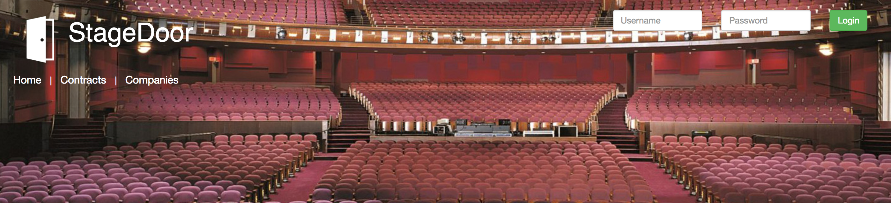

# StageDoor

Empowering users to negotiate from a position of knowledge by providing helpful tools for tracking company hiring data and personal work history.

StageDoor - https://github.com/johneckert/stagedoor

### Motivation

This project was conceived to help freelance theatre designers have access to information about average fees and past hiring practices of the companies they work for. It is hoped that access to this information will individuals to negotiate the best rates possible for their contracts as well as providing information about different hiring trends among companies.

We have attempted to keep all information as anonymous as possible while allowing all users access to aggregated data.

### Built With

* Ruby on Rails
* Google Charts using [google_visular]("https://github.com/winston/google_visualr")
* Fake seed data created with [faker]("https://github.com/stympy/faker")

### Prerequsites

Ruby v5.1.4

### Setup

1.  Fork and Clone this repo - https://github.com/johneckert/dr-meowrio-backend
2.  Install Gems `bundle install`
3.  Setup Database `rake db:create`, then run `rake db:migrate`
4.  You may run `rake db:seed`, to seed database with randomly generated user data.
5.  Start your server `rails s`
6.  Navigate to http://localhost:3000

### Contributors

* [John Eckert]("https://github.com/johneckert")
* [Julien Tregoat]("https://github.com/julientregoat")
